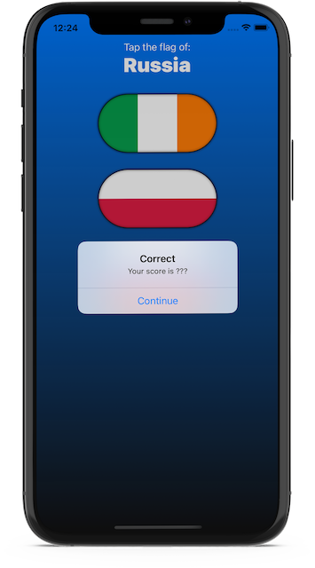
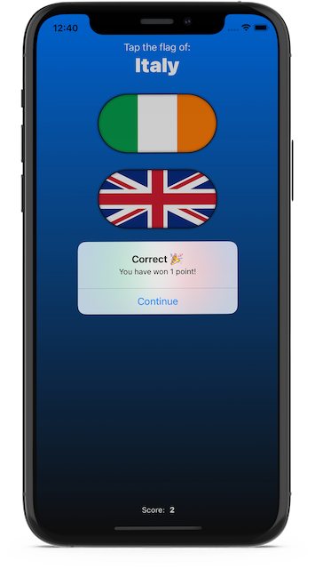
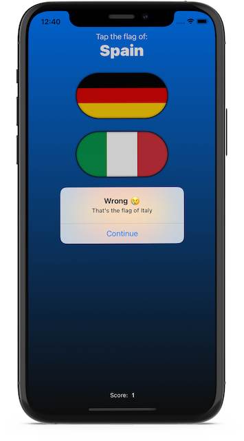

# Guess The Flag (SwiftUI)

## Description

A guessing game that helps users learn some of the many flags of the world.

## Screenshot

### v1.0

### v1.1

| Correct Answer | Wrong Answer |
| -------------- | ------------ |
|  |  |